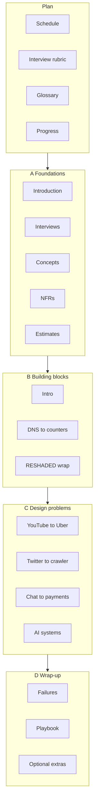

# Home

Map of this vault. Start here.

**Course (public page):** [Grokking the System Design Interview](https://www.educative.io/courses/grokking-the-system-design-interview)

This vault is an **original study plan**. It maps to the **public** module list only. It does not contain Educative lesson text, quizzes, or solutions.

## How to move
1. Read [[README]] if this is your first open.
2. Pick a track in [[Schedule]].
3. Work one module note a session. Tick `- [ ]` todos.
4. Update [[PROGRESS]] when a note is done.

Plan notes: [[Schedule]] · [[Interview-Rubric]] · [[Glossary]] · [[PROGRESS]]

Templates: [[Templates/Building-Block]] · [[Templates/Design-Problem]]

## Map

## Progress overview
Tick these as you go, or keep a single source of truth in [[PROGRESS]].

**Modules:** 0 / 49 done

| Section | Notes | Est. time |
| --- | ---: | ---: |
| [A Foundations](#a-foundations) | 5 | ~3.5 h |
| [B Building blocks](#b-building-blocks) | 20 | ~16 h |
| [C Design problems](#c-design-problems) | 20 | ~28 h |
| [D Wrap-up](#d-wrap-up) | 4 | ~2.5 h |

## A. Foundations
- [ ] [[Introduction|Introduction]] — 30 min
- [ ] [[System-Design-Interviews|System Design Interviews]] — 45 min
- [ ] [[Preliminary-Concepts|Preliminary Concepts]] — 50 min
- [ ] [[Non-Functional-Characteristics|Non-Functional Characteristics]] — 50 min
- [ ] [[Back-of-the-Envelope-Calculations|Back-of-the-Envelope Calculations]] — 55 min

## B. Building blocks
- [ ] [[Building-Blocks-Introduction|Building Blocks — Introduction]] — 30 min
- [ ] [[DNS|DNS]] — 45 min
- [ ] [[Load-Balancers|Load Balancers]] — 50 min
- [ ] [[Databases|Databases]] — 60 min
- [ ] [[Key-Value-Store|Key-Value Store]] — 55 min
- [ ] [[CDN|CDN]] — 45 min
- [ ] [[Sequencer|Sequencer]] — 45 min
- [ ] [[Distributed-Monitoring|Distributed Monitoring]] — 50 min
- [ ] [[Monitor-Server-Side-Errors|Monitor Server-Side Errors]] — 40 min
- [ ] [[Monitor-Client-Side-Errors|Monitor Client-Side Errors]] — 40 min
- [ ] [[Distributed-Cache|Distributed Cache]] — 55 min
- [ ] [[Distributed-Messaging-Queue|Distributed Messaging Queue]] — 55 min
- [ ] [[Pub-Sub|Pub-Sub]] — 50 min
- [ ] [[Rate-Limiter|Rate Limiter]] — 50 min
- [ ] [[Blob-Store|Blob Store]] — 50 min
- [ ] [[Distributed-Search|Distributed Search]] — 55 min
- [ ] [[Distributed-Logging|Distributed Logging]] — 45 min
- [ ] [[Distributed-Task-Scheduler|Distributed Task Scheduler]] — 50 min
- [ ] [[Sharded-Counters|Sharded Counters]] — 40 min
- [ ] [[Concluding-Building-Blocks|Concluding Building Blocks / RESHADED]] — 50 min

## C. Design problems
- [ ] [[YouTube|YouTube]] — 90 min
- [ ] [[Quora|Quora]] — 80 min
- [ ] [[Google-Maps|Google Maps]] — 90 min
- [ ] [[Yelp-Proximity|Yelp / Proximity]] — 80 min
- [ ] [[Uber|Uber]] — 90 min
- [ ] [[Twitter|Twitter]] — 90 min
- [ ] [[Newsfeed|Newsfeed]] — 80 min
- [ ] [[Instagram|Instagram]] — 85 min
- [ ] [[TinyURL|TinyURL]] — 70 min
- [ ] [[Web-Crawler|Web Crawler]] — 80 min
- [ ] [[WhatsApp|WhatsApp]] — 90 min
- [ ] [[Typeahead|Typeahead]] — 75 min
- [ ] [[Google-Docs|Google Docs]] — 90 min
- [ ] [[Deployment|Deployment System]] — 75 min
- [ ] [[Payment|Payment System]] — 90 min
- [ ] [[LeetCode|LeetCode]] — 80 min
- [ ] [[ChatGPT|ChatGPT]] — 90 min
- [ ] [[Data-Infrastructure|Data Infrastructure]] — 85 min
- [ ] [[LLM-Support-Bot|LLM Support Bot]] — 85 min
- [ ] [[AI-Code-Assistant|AI Code Assistant]] — 85 min

## D. Wrap-up
- [ ] [[Lessons-from-System-Failures|Lessons from System Failures]] — 50 min
- [ ] [[Concluding-Remarks|Concluding Remarks]] — 40 min
- [ ] [[Free-Lessons|Free Lessons (optional)]] — 30 min
- [ ] [[Case-Studies|Case Studies (optional)]] — 40 min

## Suggested order
Follow prev/next links at the top of each note. The chain is:

Foundations → Building blocks → Design problems → Wrap-up.

[[Introduction]] is the first module. [[Case-Studies]] is the last.

## Plugins (optional)
You can use this vault with core Obsidian only. Tasks and Dataview are optional. See [[README]].
